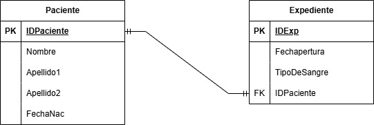
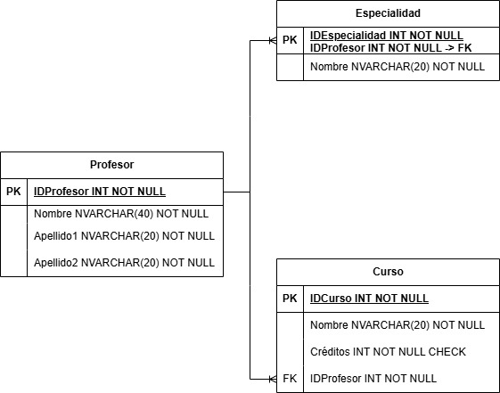
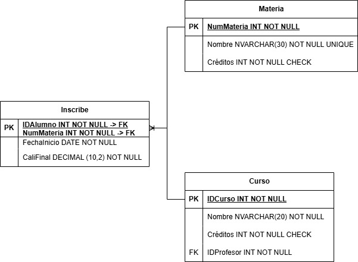
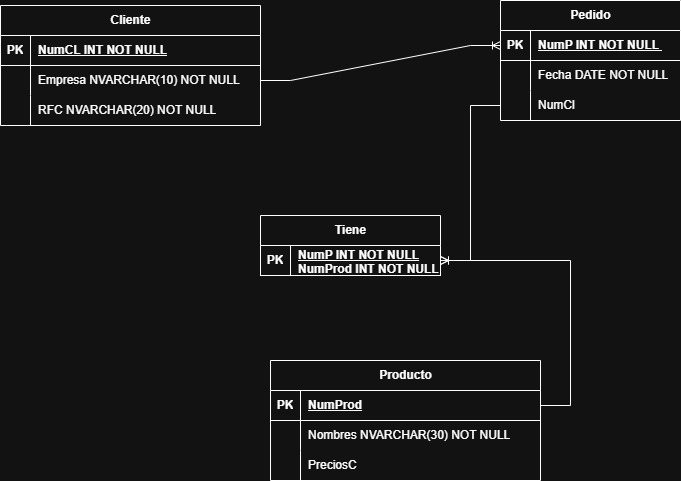

# Ejercicios del modelo E-R

1. Ejercicio 1. Hospital

## Modelo E-R

## Modelo Relacional

2. Ejercicio 2. Profesor

## Modelo E-R

## Modelo Relacional

3. Ejercicio 3. Inscripción

## Modelo E-R

## Modelo Relacional

4. Ejercicio 3. Pedidos

## Modelo E-R

## Modelo Relacional

