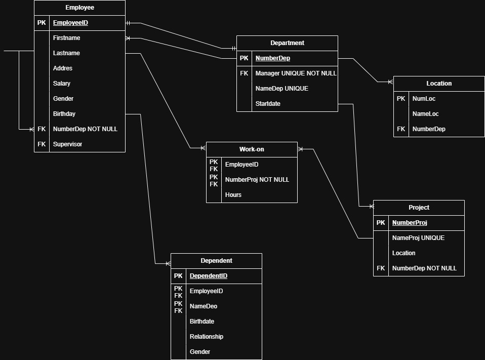

# Diccionario de datos de la base de datos de una compañía (ejercicio 5)

1. Información general

| Elemento | Valor |
|-----------|------|
| Proyecto | Compañía |
| Versión | 1.0 |
| Fecha | Junio 2026 |
| Elaboró | Lic. Patricio Fernando Panales Nolasco |
| SGBD | SQLServer |

2. Descripción del sistema de base de datos 

El sistema administra:

- Departamento
- Dependiente
- Empleado
- Localidades 
- Proyectos
- Trabaja-en

Permite controlar la estructura organizacional de la compañía

3. Catálogo de restricciones utilizadas

| Código | Significado |
|----------|----------|
| PK    | Primary Key |
| FK    | Foreign Key |
| NN    | Not Null |
| UQ    | Unique |
| AI    | Auto Increment |
| CK    | Check |
| DF    | Default |

4. Diccionario de datos

## Tabla: Departamento

| Campo | Tipo | Longitud | Restricciones | Descripción |
|-----------|-----------|-----------|-----------|-----------|
| id_departamento | INT | - | PK, AI, NN | Identificador del departamento |
| nombre | NVARCHAR | 30 | UQ, NN | Nombre único del departamento |
| fecha_inicio | DATE | - | NN | Fecha de inicio de la supervisión |
| id_supervisor | INT | - | FK, UQ, NN | Empleado que supervisa el departamento |

## Tabla: Dependiente

| Campo | Tipo | Longitud | Restricciones | Descripción |
|-----------|-----------|-----------|-----------|-----------|
| id_dependiente | INT | - | PK, AI, NN | Identificador único del dependiente |
| nombre | NVARCHAR | 30 | NN | Nombre del dependiente |
| genero | CHAR | 1 | NN | Género del dependiente |
| fecha_nacimiento | DATE | - | NN | Fecha de nacimiento |
| tipo_relacion | NVARCHAR | 50 | NN | Relación con el empleado |
| id_empleado | INT | - | FK, NN | Empleado al que pertenece el dependiente |

## Tabla: Empleado

| Campo | Tipo | Longitud | Restricciones | Descripción |
|-----------|-----------|-----------|-----------|-----------|
| id_empleado | INT | - | PK, AI, NN | Identificador único del empleado |
| numero_seguro_social | VARCHAR | 20 | UQ, NN | Número de seguro social |
| nombre | NVARCHAR | 30 | NN | Nombre |
| apellido | NVARCHAR | 30 | NN | Apellido |
| direccion | VARCHAR | 50 | NN | Dirección del empleado |
| salario | DECIMAL | 12,2 | NN, CK(>0) | Salario del empleado |
| genero | CHAR | 1 | NN | Género del empleado |
| fecha_nacimiento | DATE | - | NN | Fecha de nacimiento |
| id_departamento | INT | - | FK, NN | Departamento al que pertenece |
| id_supervisor | INT | - | FK | Supervisor directo del empleado |

## Tabla: Localidades

| Campo | Tipo | Longitud | Restricciones | Descripción |
|-----------|-----------|-----------|-----------|-----------|
| id_localidad | INT | - | PK, AI, NN | Identificador único de la localidad |
| nombre_localidad | NVARCHAR | 50 | NN | Nombre de la localidad |
| id_departamento | INT | - | FK, NN | Departamento al que pertenece la localidad |

## Tabla: Proyectos

| Campo | Tipo | Longitud | Restricciones | Descripción |
|-----------|-----------|-----------|-----------|-----------|
| id_proyecto | INT | - | PK, AI, NN | Identificador del proyecto |
| nombre | NVARCHAR | 30 | NN | Nombre único del proyecto |
| localidad | NVARCHAR | 50 | NN | Localidad del proyecto |
| id_departamento | INT | - | FK, NN | Departamento que controla el proyecto |

## Tabla: Trabaja-en

| Campo | Tipo | Longitud | Restricciones | Descripción |
|-----------|-----------|-----------|-----------|-----------|
| id_empleado | INT | - | FK, NN | Empleado asignado |
| id_proyecto | INT | - | FK, NN | Proyecto asignado |
| horas_semana | DECIMAL | 5,2 | NN, CK(>0) | Horas trabajadas por semana |

--

5. Relaciones en la base de datos

| Relación | Cardinalidad | Descripción |
|-----------|-----------|-----------|
| Departamento -> Empleado | 1:N | Un departamento tiene varios empleados |
| Departamento -> Empleado | 1:1 | Un departamento tiene un supervisor |
| Departamento -> Proyecto | 1:N | Un departamento controla varios proyectos |
| Departamento -> Localidad | 1:N | Un departamento puede tener varias localidades |
| Empleado -> Empleado | 1:N | Un supervisor puede supervisar varios empleados |
| Empleado -> Dependiente | 1:N | Un empleado puede tener dependientes |
| Empleado -> Trabaja-en | 1:N | Un empleado puede trabajar en varios proyectos |
| Proyecto -> Trabaja-en | 1:N | Un proyecto puede tener varios empleados asignados |

6. Matriz de claves foráneas

| Tabla | Campo FK | Referencia |
|-----------|-----------|-----------|
| Departamento | id_supervisor | Empleado (id_empleado) |
| Empleado | id_departamento | Departamento (id_departamento) |
| Empleado | id_supervisor | Empleado (id_empleado) |
| Localidad | id_departamento | Departamento (id_departamento) |
| Dependiente | id_empleado | Empleado (id_empleado) |
| Proyecto | id_departamento | Departamento (id_departamento) |
| Trabaja-en | id_empleado | Empleado (id_empleado) |
| Trabaja-en | id_proyecto | Proyecto (id_proyecto) |

7. Integridad referencial

| Código | Reglas |
|-----------|-----------|
| IR-01 | No se puede registrar un empleado en un departamento inexistente |
| IR-02 | No se puede registrar un proyecto para un departamento inexistente |
| IR-03 | No se puede registrar una asignación para un empleado inexistente |
| IR-04 | No se puede registrar una asignación para un proyecto inexistente |
| IR-05 | No se puede registrar un dependiente para un empleado inexistente |
| IR-06 | No se puede asignar un supervisor inexistente a un empleado |
| IR-07 | No se puede eliminar un departamento que tenga empleados o proyectos asociados |

8. Reglas del negocio

| Código | Descripción |
|-----------|-----------|
| RN-01 | Un empleado es asignado a un solo departamento |
| RN-02 | Un departamento puede tener varios empleados |
| RN-03 | Un empleado puede trabajar en varios proyectos |
| RN-04 | Un proyecto puede tener varios empleados trabajando |
| RN-05 | Un departamento controla varios proyectos |
| RN-06 | Cada proyecto es controlado por un único departamento |
| RN-07 | Se debe registrar el número de horas por semana que un empleado trabaja en un proyecto |
| RN-08 | Se registra un supervisor directo de cada empleado, que a su vez, el supervisor, también es un empleado |
| RN-09 | Se registra la fecha de inicio en la que un supervisor administra un departamento |

9. Diagrama relacional

