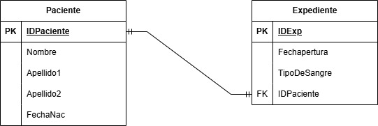
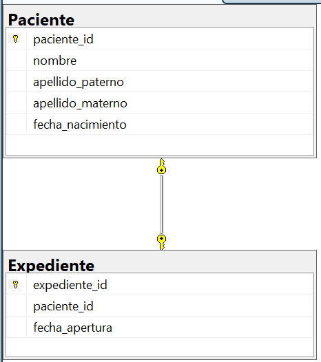

```SQL

--CREAR BASE DE DATOS
CREATE DATABASE registro_expediente_hospital;
GO

--USAR BASE DE DATOS
USE registro_expediente_hospital;
GO

--PRIMERO SE HACE LA QUE NO TIENE FOREIGN KEY
/*EN ESTE CASO SE TRATA DE UNA RELACIÓN UNO A UNO*
*Y LAS FOREIGN KEYS SE PONEN EN AMBAS TABLAS*/
--TABLA PACIENTE
CREATE TABLE Paciente (
    paciente_id CHAR(5) NOT NULL,
    nombre VARCHAR(30) NOT NULL,
    apellido_paterno VARCHAR(15) NOT NULL,
    apellido_materno VARCHAR(15) NOT NULL,
    fecha_nacimiento DATE NOT NULL,

    CONSTRAINT pk_paciente
    PRIMARY KEY (paciente_id)
);
GO


--CREAR TABLA EXPEDIENTE
CREATE TABLE Expediente (
    expediente_id CHAR(5) NOT NULL,
    paciente_id CHAR(5) NOT NULL,
    fecha_apertura DATE NOT NULL,
    tipo_sangre VARCHAR(3) NOT NULL,

    CONSTRAINT ck_expediente_tipo_sangre
	CHECK (tipo_sangre IN ('A+','A-','B+','B-','AB+','AB-','O+','O-')),

    CONSTRAINT pk_expediente
    PRIMARY KEY (expediente_id),

    CONSTRAINT uq_expediente_paciente
    UNIQUE (paciente_id),

    CONSTRAINT fk_expediente_paciente
    FOREIGN KEY (paciente_id)
    REFERENCES Paciente(paciente_id)
);
GO

SELECT * FROM Paciente;
SELECT * FROM Expediente;

```

## Modelo E-R


## Modelo Relacional


## Modelo Relacional SQL

