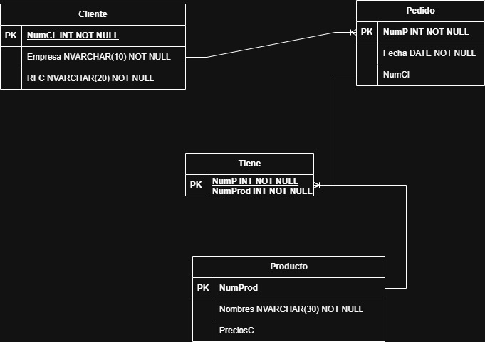
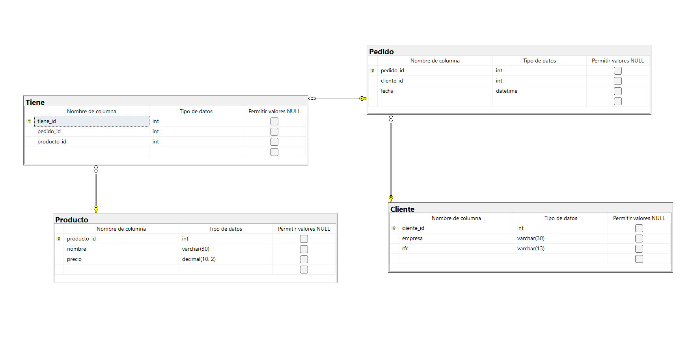

```SQL

--CREAR BASE DE DATOS
CREATE DATABASE venta_producto;
GO

--USAR BASE DE DATOS
USE venta_producto;
GO

-- TABLA CLIENTE (Sin foreign keys)
CREATE TABLE Cliente(
    cliente_id INT NOT NULL IDENTITY(1,1),
    empresa VARCHAR(30) NOT NULL,
    rfc VARCHAR(13) NOT NULL,

    CONSTRAINT pk_cliente PRIMARY KEY (cliente_id),
    CONSTRAINT uq_cliente_rfc UNIQUE (rfc)
);
GO

-- TABLA PRODUCTO (Sin foreign keys)
CREATE TABLE Producto(
    producto_id INT NOT NULL IDENTITY(1,1),
    nombre VARCHAR(30) NOT NULL,
    precio DECIMAL(10,2) NOT NULL,

    CONSTRAINT pk_producto PRIMARY KEY (producto_id),
    CONSTRAINT ck_producto_precio CHECK (precio > 0)
);
GO

-- TABLA PEDIDO (Depende de Cliente)
CREATE TABLE Pedido(
    pedido_id INT NOT NULL IDENTITY(1,1),
    cliente_id INT NOT NULL,
    fecha DATETIME NOT NULL,

    CONSTRAINT pk_pedido PRIMARY KEY (pedido_id),
    CONSTRAINT fk_pedido_cliente FOREIGN KEY (cliente_id) REFERENCES Cliente(cliente_id)
);
GO

-- TABLA TIENE / DETALLE (Depende de Pedido y Producto)
CREATE TABLE Tiene(
    tiene_id INT NOT NULL IDENTITY(1,1),
    pedido_id INT NOT NULL,
    producto_id INT NOT NULL,

    CONSTRAINT pk_tiene PRIMARY KEY (tiene_id),
    CONSTRAINT fk_tiene_pedido FOREIGN KEY (pedido_id) REFERENCES Pedido(pedido_id),
    CONSTRAINT fk_tiene_producto FOREIGN KEY (producto_id) REFERENCES Producto(producto_id)
);
GO

-- CONSULTAS DE VERIFICACIÓN
SELECT * FROM Cliente;
SELECT * FROM Producto;
SELECT * FROM Pedido;
SELECT * FROM Tiene;

```

## Modelo E-R


## Modelo Relacional


## Modelo Relacional SQL
